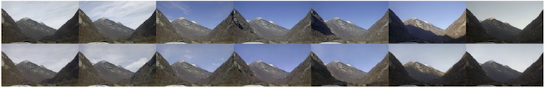

# Photographic Visualizations of Weather Forecasts

This is the companion repository for our paper on [Photographic Visualizations of Weather Forecasts](https://arxiv.org/abs/2203.15601). It contains the Tensorflow implementations of the generator and discriminator networks, as well as the code to reproduce the experiments presented in Sections 1.2 and 4 of the paper.

The data used in the expert evaluations and their detailed results (summarized in Tables 2, 3 and 4 of the paper) are also available.

Because of the large file size of the trained models, they are only availble in the [Zenodo upload](https://doi.org/10.5281/zenodo.6962721) (which also contains everything else from this GitHub repository).

The complete image archive and COSMO-1 forecast fields used for the training and evaluation of the networks can not be published online due to licensing restrictions. But they can be obtained free of charge for academic research purposes by contacting the MeteoSwiss [customer service desk](https://www.meteoswiss.admin.ch/home/form/customer-service.html). Once obtained, add the images to `data/raw__/image` and the COSMO-1 `.csv` files to `data/raw__/cosmo_1-2019-2020` (see the examples therein), and regenerate the training and testing data sets using the scripts in `data/cosmo/surface` and `data/nowcasting`.
